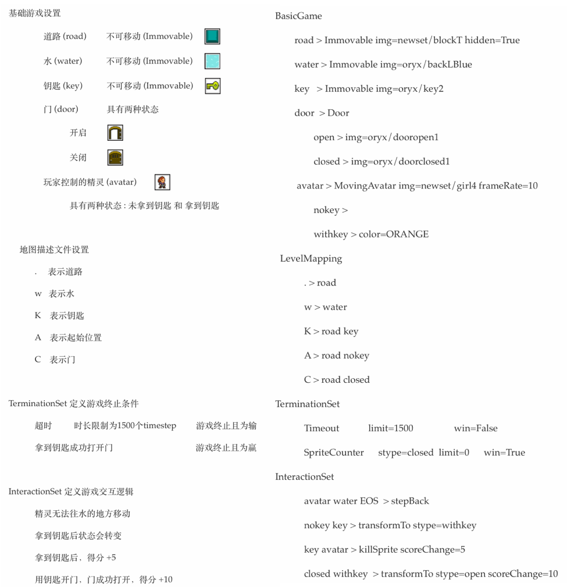
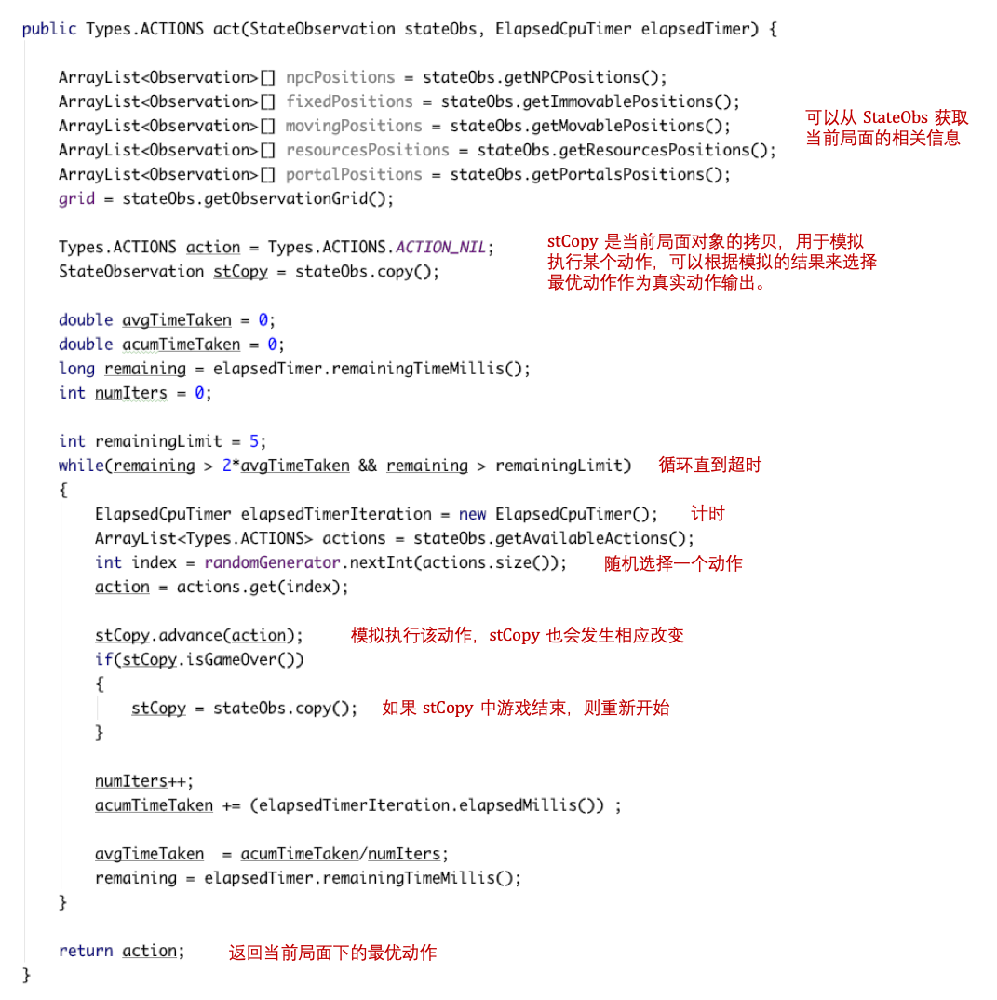
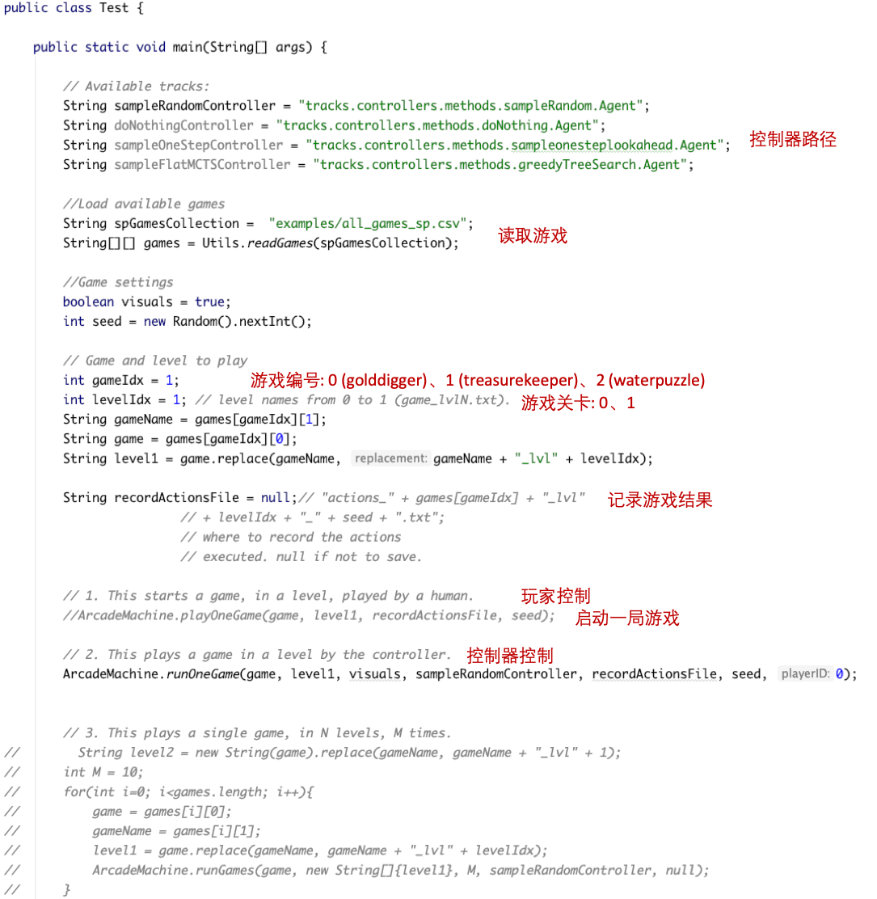

# GVGAI 框架介绍

## 游戏描述文件

位于 `examples` 目录下，`all_games_sp.csv` 文件存放三个游戏配置文件的路径，`gridphysics` 目录存放每个游戏的配置文件以及不同关卡的地图描述文件。

以 水谜题 游戏举例

## 控制程序

位于 src/tracks 目录下，controllers 目录下存放多个样例的控制程序，我们提供了 4 个简单的控制程序作为参考。我们以 sampleRandom 控制程序为例，做简单介绍：

每个控制器都是由一个继承自 `core.player.AbstractPlayer.java` 的 Java 类构成，这个类必须命名为Agent.java且必须实现两个公共方法：

​		**public Agent(StateObservation so, ElapsedCpuTimer elapsedTimer)**   

​		**public Types.ACTIONS act(StateObservation stateObs, ElapsedCpuTimer elapsedTimer)**   

两个方法都需要两个参数 **StateObservation so** 和 **ElapsedCpuTimer elapsedTimer**，其中：

​	**StateObservation so**: 定义了 agent 当前所处的状态信息

​	**ElapsedCpuTimer elapsedTimer**: 是一个类，它允许查询代理返回一个动作的剩余CPU时间。

我们下面具体介绍一下 **public Types.ACTIONS act** 类

 

## 测试程序

位于 src/tracks 目录下，Test.java 为测试文件

测试文件提供了4种方法：

​	1. 玩家控制

​	2. 控制器控制

​	3. 控制器在 某个游戏 level N 上 重复 M 次 

​    4. 控制器在 N 个游戏 前 L 个 level 上，每个重复 M 次	

